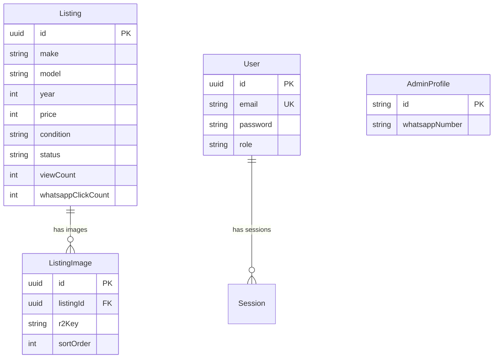

# PRODUCT REQUIREMENTS DOCUMENT

# Carzaar — Nigerian Car Marketplace

**v2.0** | **Functional Prototype** | **Carzaar Engineering**

> **Revision note:** Initial PRD generated from full codebase analysis of the v2.0 production build. Covers all implemented features, inferred business model, and forward-looking roadmap. Migrated from legacy Appwrite backend to Next.js + PostgreSQL architecture.

---

## Contents

1. [Product Summary](#1-product-summary)
2. [Problem Statement](#2-problem-statement)
3. [Goals and Non-Goals](#3-goals-and-non-goals)
4. [User Personas](#4-user-personas)
5. [Functional Requirements](#5-functional-requirements)
6. [Core Technical Pipeline](#6-core-technical-pipeline)
7. [Technical Requirements](#7-technical-requirements)
8. [Business Model](#8-business-model)
9. [Risks](#9-risks)
10. [Data Model](#10-data-model)
11. [Success Metrics](#11-success-metrics)
12. [Assumptions](#12-assumptions)
13. [Phased Roadmap](#13-phased-roadmap)
14. [Open Questions](#14-open-questions)

---

## 1. Product Summary

Carzaar is a Nigeria-focused online car marketplace that enables buyers to browse, filter, and inquire about cars for sale. The platform connects prospective buyers directly to the dealer/admin via WhatsApp — eliminating the friction of forms, callbacks, and middlemen. A single admin manages the entire inventory through a protected dashboard: creating detailed listings with rich vehicle metadata (make, model, condition, accident history, documentation status), uploading up to 8 high-resolution photos per listing, and tracking engagement via atomic view and WhatsApp-click counters. The system also provides a lightweight "Sell Your Car" modal that lets private sellers initiate a WhatsApp conversation with the dealer to discuss consignment or purchase.

**Core value proposition:** A clean, fast, mobile-first car browsing experience built for the Nigerian market, with zero-friction WhatsApp-based buyer-to-dealer communication and Nigeria-specific vehicle metadata (Tokunbo classification, Naira pricing, documentation status).

---

## 2. Problem Statement

### Market gaps

The Nigerian used-car market is fragmented across WhatsApp groups, Instagram pages, and legacy classifieds sites (e.g., Jiji, Cars45). These platforms suffer from:

- **Stale inventory:** Listings remain visible long after a car is sold, wasting buyer time.
- **Poor search/filter UX:** Most platforms lack granular filtering by condition (Tokunbo vs. Nigerian Used), body type, mileage range, or documentation status.
- **Trust deficit:** Buyers cannot easily verify accident history, service records, spare key availability, or warranty status before contacting a seller.
- **Communication friction:** Many platforms require account creation, form submissions, or in-platform messaging before a buyer can speak to the seller.

### User pain points

| Pain point | Who feels it | Carzaar solution |
|---|---|---|
| Can't tell if a car is still available | Buyer | Real-time status badges (Available / Reserved / Sold) |
| No way to filter Tokunbo vs Nigerian Used | Buyer | Dedicated condition filter with counts |
| Must create an account to inquire | Buyer | Zero-auth WhatsApp CTA |
| Managing listings across WhatsApp + Instagram is tedious | Dealer/Admin | Centralized admin dashboard with analytics |
| No visibility into which cars get the most interest | Dealer/Admin | View count + WhatsApp click counters |

---

## 3. Goals and Non-Goals

### Goals

1. **Provide a fast, mobile-first car browsing experience** with rich filtering (make, price, year, condition, mileage, body type, color, fuel, transmission, location).
2. **Enable zero-friction buyer inquiries** via direct WhatsApp deep-links with pre-filled messages.
3. **Centralize inventory management** in a single admin dashboard with CRUD operations, image management, and status tracking.
4. **Capture Nigeria-specific vehicle metadata** including condition classification (Brand New / Nigerian Used / Tokunbo), documentation status, accident history, and spare key availability.
5. **Track engagement analytics** via atomic view and WhatsApp-click counters per listing.
6. **Deliver fast page loads** with a vanilla HTML/CSS/JS frontend that avoids heavy SPA frameworks.
7. **Support SEO** with semantic HTML, Open Graph tags, and descriptive meta content for organic discovery.
8. **Provide a "Sell Your Car" flow** that lets private sellers initiate consignment conversations via WhatsApp.

### Non-Goals

1. **In-platform messaging or chat** — all communication is routed through WhatsApp.
2. **Online payments or transactions** — Carzaar is a listing/discovery platform, not a transactional marketplace.
3. **User accounts for buyers** — no registration, login, wishlists, or saved searches for public-facing users.
4. **Multi-dealer/multi-tenant support** — the system is designed for a single admin/dealer operator.
5. **Vehicle financing or loan integrations** — no bank or fintech partnerships in scope.
6. **AI-powered valuation or pricing recommendations** — pricing is set manually by the admin.

---

## 4. User Personas

### Persona 1: Chidi — The Car Buyer

**Age:** 28–45 · **Location:** Lagos / Abuja

Chidi is a mid-career professional looking to buy a reliable used car. He browses on his mobile phone during commutes and lunch breaks. He distrusts platforms where listings stay up after a car is sold. He wants to quickly filter by budget (₦3M–₦7M), condition (Tokunbo preferred), and body type (SUV). When he finds a car he likes, he wants to message the seller instantly — not fill out a form and wait for a callback.

- **Needs:** Fast filtering, honest status indicators, instant WhatsApp contact, vehicle history transparency.
- **Behavior:** Browses 10–20 listings per session, opens 2–3 detail pages, clicks WhatsApp on 1.
- **Frustrations:** Outdated listings, unclear pricing, inability to verify documentation status.

### Persona 2: Segun — The Dealer/Admin

**Age:** 30–50 · **Location:** Lagos

Segun operates a car dealership and currently manages his inventory across WhatsApp statuses, Instagram posts, and word of mouth. He needs a professional web presence to showcase his cars and track which listings generate the most inquiries. He wants to quickly add new listings with photos, mark cars as sold, and see view/engagement stats — all from his phone or laptop.

- **Needs:** Easy listing creation, multi-image upload, status management (Available → Sold), basic analytics.
- **Behavior:** Adds 2–5 listings per week, edits prices occasionally, marks 1–3 cars as sold weekly.
- **Frustrations:** Managing inventory across multiple platforms, no engagement metrics, repetitive WhatsApp conversations about already-sold cars.

### Persona 3: Funke — The Private Seller

**Age:** 25–55 · **Location:** Any major Nigerian city

Funke is selling her personal car and doesn't want to deal with the complexity of creating a full listing. She sees the "Sell your car" button on Carzaar, enters her car's make, model, and year, and is immediately connected to the dealer via WhatsApp to discuss consignment or direct purchase.

- **Needs:** Simple, frictionless way to initiate a sell conversation.
- **Behavior:** One-time visitor, uses the sell modal once.

---

## 5. Functional Requirements

### 5.1 Listing Browsing (Public)

| ID | Requirement |
|---|---|
| R1 | The system shall display all listings with `status=available` on the homepage in a responsive grid layout, sorted by newest first. |
| R2 | The system shall support client-side filtering by: location (text search), price range (min/max + preset chips: Under ₦3M, ₦3M–₦7M, ₦7M–₦15M, ₦15M+), year range, condition, make, transmission, mileage range, body type, color, and fuel type. |
| R3 | The system shall support sorting by: newest first, price low-to-high, price high-to-low. |
| R4 | The system shall display dynamic facet counts next to each filter option (e.g., "Toyota (12)"). |
| R5 | The system shall render skeleton loading states during data fetching. |
| R6 | The system shall display an empty state with a "Reset all filters" button when no listings match the current filters. |
| R7 | The system shall paginate results in batches of 12 with a "Load more cars" button. |
| R8 | The system shall generate quick-filter chips for the top 6 makes found in the current result set. |
| R9 | The system shall provide a mobile-responsive filter panel (bottom sheet) with a dedicated toggle button and overlay. |

### 5.2 Listing Detail (Public)

| ID | Requirement |
|---|---|
| R10 | The system shall display a full detail page for each listing accessed via `/listings/detail.html?id={uuid}`. |
| R11 | The system shall render an image gallery with thumbnail navigation, previous/next buttons, and lazy-loaded images. |
| R12 | The system shall display Overview specs (make, model, year, condition, mileage, price), Technical specs (transmission, fuel, body type, drivetrain, color, engine capacity, doors, seats, VIN, plate number), and History/Documentation (previous owners, accident history, service history, spare key, documentation status, warranty). |
| R13 | The system shall display a features list rendered as tag chips. |
| R14 | The system shall display a "SOLD" watermark overlay on the gallery and disable the WhatsApp CTA when `status=sold`. |
| R15 | The system shall atomically increment `viewCount` on each detail page load. |
| R16 | The system shall dynamically update the page `<title>` to `{Make} {Model} {Year} — Carzaar`. |

### 5.3 WhatsApp Integration

| ID | Requirement |
|---|---|
| R17 | The system shall render a prominent "Chat on WhatsApp" button on each listing detail page. |
| R18 | The system shall open a `https://wa.me/{number}?text={prefilledMessage}` deep-link with a pre-filled message: "Hello, I'm interested in the {Make} {Model} {Year} listed on Carzaar. Is it still available?" |
| R19 | The system shall atomically increment `whatsappClickCount` on each WhatsApp button click. |
| R20 | The system shall use a hardcoded default WhatsApp number (`2349158461502`) with the `AdminProfile` table ready for future dynamic configuration. |

### 5.4 Sell Your Car (Public)

| ID | Requirement |
|---|---|
| R21 | The system shall display a "Sell your car" link in the header of all public pages. |
| R22 | The system shall open a modal form collecting make, model, and year when the link is clicked. |
| R23 | The system shall display a live preview of the WhatsApp message as the user types. |
| R24 | The system shall open a WhatsApp deep-link with a pre-filled sell message: "Hi, I am selling my {Make} {Model} {Year}. Contact me for more details." |

### 5.5 Admin Authentication

| ID | Requirement |
|---|---|
| R25 | The system shall provide a login page at `/admin/login.html` accepting email and password. |
| R26 | The system shall authenticate admins via bcrypt password comparison and issue a JWT (HS256, 30-day expiry) stored in an `httpOnly`, `secure`, `sameSite=lax` cookie named `auth-token`. |
| R27 | The system shall protect all admin pages via a client-side auth guard that redirects unauthenticated users to the login page. |
| R28 | The system shall protect all mutation API endpoints (POST, PUT, DELETE on listings and images) via server-side JWT verification. |
| R29 | The system shall support sign-out by clearing the auth cookie (setting `maxAge=0`). |

### 5.6 Admin Dashboard

| ID | Requirement |
|---|---|
| R30 | The system shall display a table of all listings (all statuses) at `/admin/dashboard.html` showing make, model, year, location, price, status badge, view count, and WhatsApp click count. |
| R31 | The system shall provide inline actions: Edit (navigates to listing form), Mark Sold / Mark Available (with confirmation dialog), and Delete (with confirmation dialog). |
| R32 | The system shall display toast notifications for successful and failed operations. |

### 5.7 Admin Listing Management

| ID | Requirement |
|---|---|
| R33 | The system shall provide a listing creation/edit form at `/admin/listing-form.html` with fields for all vehicle attributes defined in the Prisma schema. |
| R34 | The system shall validate all listing data server-side using Zod schemas, returning structured error messages for invalid input. |
| R35 | The system shall support multi-image upload (up to 8 images per listing, max 5MB each, JPG/PNG/WebP only) via multipart form data. |
| R36 | The system shall display image previews with delete capability when editing an existing listing. |
| R37 | The system shall present a checklist of 24 vehicle features (Air Conditioning, Sunroof, Reverse Camera, Bluetooth, Navigation System, Leather Seats, Cruise Control, Alloy Wheels, Parking Sensors, Push Start, Keyless Entry, Climate Control, Fog Lights, Third Row Seats, Tow Package, Moonroof, Heated Seats, Apple CarPlay, Android Auto, 360 Camera, Blind Spot Monitor, Lane Departure Warning, Adaptive Cruise Control, Premium Audio). |
| R38 | The system shall pre-populate all form fields when editing an existing listing (accessed via `?id={uuid}`). |
| R39 | When a listing is deleted, the system shall cascade-delete all associated `ListingImage` records and remove the corresponding files from storage. |

### 5.8 Image Handling

| ID | Requirement |
|---|---|
| R40 | The system shall generate unique file keys using the pattern `listings/{listingId}/{timestamp}-{random}.{extension}`. |
| R41 | The system shall serve images via `/api/listings/images/{imageId}` by performing a database lookup and redirecting to the local file URL. |
| R42 | The system shall store images in `public/uploads/` on the local filesystem, with the storage layer abstracted behind `uploadToR2()` / `deleteFromR2()` functions ready for Cloudflare R2 migration. |

---

## 6. Core Technical Pipeline

### Stage 1: Listing Ingestion (Admin)

- **Input:** Admin fills the listing form with vehicle data + selects image files.
- **Work:** Client-side validation → POST `/api/listings` with JSON body → Zod schema validation → Prisma `listing.create()`.
- **Output:** New `Listing` record with UUID.

### Stage 2: Image Upload (Admin)

- **Input:** Selected image files (max 8, max 5MB each, JPG/PNG/WebP).
- **Work:** Multipart POST `/api/listings/{id}/images` → server-side type/size validation → generate unique key → write to `public/uploads/` → create `ListingImage` record.
- **Output:** `ListingImage` records linked to the listing, files on disk.

### Stage 3: Listing Discovery (Buyer)

- **Input:** Buyer loads homepage.
- **Work:** GET `/api/listings?status=available` → Prisma `listing.findMany()` with eager-loaded images → client-side filtering, sorting, pagination.
- **Output:** Rendered card grid with images, prices, conditions, locations.

### Stage 4: Listing Engagement (Buyer)

- **Input:** Buyer clicks a listing card.
- **Work:** GET `/api/listings/{id}` → render detail page + gallery → fire-and-forget POST `/api/listings/{id}/increment` with `{ field: "viewCount" }`.
- **Output:** Full detail view rendered; `viewCount` atomically incremented.

### Stage 5: WhatsApp Conversion (Buyer → Dealer)

- **Input:** Buyer clicks "Chat on WhatsApp" button.
- **Work:** Construct `wa.me` URL with pre-filled message → open in new tab → fire-and-forget POST `/api/listings/{id}/increment` with `{ field: "whatsappClickCount" }`.
- **Output:** WhatsApp conversation initiated; `whatsappClickCount` atomically incremented.

### Stage 6: Status Management (Admin)

- **Input:** Admin clicks "Mark Sold" or "Mark Available" in dashboard.
- **Work:** PUT `/api/listings/{id}` with `{ status, soldAt }` → Prisma update → reload dashboard.
- **Output:** Status and `soldAt` timestamp updated; SOLD overlay appears on public-facing pages.

**Cost ceiling:** [ASSUMPTION] The system currently runs on Vercel's free/hobby tier with Neon's free PostgreSQL tier. Image storage is local to the deployment; migration to Cloudflare R2 would introduce a per-GB storage cost. No AI/ML costs. Infrastructure cost target: < ₦25,000/month (~$15 USD).

---

## 7. Technical Requirements

| Component | Technology |
|---|---|
| **Framework** | Next.js 14 (App Router) |
| **Language** | TypeScript 5.3 |
| **ORM** | Prisma 5.8 |
| **Database** | PostgreSQL (Neon — serverless) |
| **Frontend** | Vanilla HTML5 + CSS Custom Properties + ES Modules (no React in the browser) |
| **Validation** | Zod 3.22 |
| **Auth** | Custom JWT (jose 6.2 + bcryptjs 3.0) |
| **Hosting** | Vercel |
| **Runtime** | Node.js 18+ |

### Worker and async processing

The application does not use background workers or async job queues. All operations (including image uploads and counter increments) are handled synchronously within API route handlers. Counter increments are "fire-and-forget" on the client side but still execute synchronously on the server.

### Storage

| Layer | Current | Migration-ready |
|---|---|---|
| Images | Cloudflare R2 (abstracted via `r2-client.ts`) | Local filesystem fallback available |
| Database | Neon PostgreSQL (serverless, connection string via `DATABASE_URL`) | Any PostgreSQL-compatible provider |
| Sessions | Stateless JWT in `httpOnly` cookie | N/A (no server-side session store needed) |

> **✅ RESOLVED:** The application now successfully uses Cloudflare R2 for persistent image storage across serverless deployments.

### AI integration boundary

No AI or ML integrations are present in the codebase. The application is purely CRUD-based.

### Auth

- **Strategy:** Custom JWT-based authentication (not using Auth.js/NextAuth despite the `NEXTAUTH_SECRET` env var name).
- **Password hashing:** bcryptjs with 12 salt rounds.
- **Token:** HS256 JWT with 30-day expiry containing `{ id, email, name, role }`.
- **Cookie:** `auth-token`, `httpOnly`, `secure`, `sameSite=lax`, 30-day `maxAge`.
- **Session check:** Server-side via `getSessionFromRequest()` (reads + verifies cookie); client-side via `initAuthGuard()` (calls `/api/auth/session`).
- **Admin-only:** All users in the `User` table have `role="admin"`. There is no role hierarchy.

### Payments

No payment processing is implemented. Carzaar is a listing/discovery platform. All transactions occur off-platform via WhatsApp negotiation.

### Error handling

| Layer | Strategy |
|---|---|
| API routes | Try/catch blocks returning `{ success: false, error: string }` with appropriate HTTP status codes (400, 401, 404, 500). Errors are logged to `console.error`. |
| Zod validation | Caught by name (`error.name === 'ZodError'`) and returned as 400 responses. |
| Frontend | Fetch failures display error states with retry buttons or toast notifications. |
| Image validation | Invalid files are silently skipped during bulk upload; if all files fail, a 400 response is returned. |
| Database | Prisma client singleton with dev-mode query logging. Global instance preserved across hot reloads. |

---

## 8. Business Model

### Current model

[ASSUMPTION] Carzaar currently operates as a **single-dealer showcase platform** — a professional web presence for one car dealership. There is no multi-seller marketplace functionality, and no payment processing.

### Potential monetization paths

| Model | Description | Target price point |
|---|---|---|
| **Dealer SaaS** | Monthly subscription for dealers to get their own Carzaar-powered storefront. | ₦15,000–₦50,000/month |
| **Featured listings** | Pay to pin a listing at the top of search results. | ₦2,000–₦5,000 per listing/week |
| **Lead fees** | Charge dealers per WhatsApp click (verified lead). | ₦500–₦1,500 per click |
| **Marketplace commission** | Take a percentage of the sale price when a deal closes. | 0.5%–2% of sale value |

### Pricing principles

- [ASSUMPTION] Currency is NGN (Nigerian Naira), whole units (no kobo). Price field stores integers.
- No decimal pricing — prices are displayed with the ₦ symbol and comma formatting (`₦4,500,000`).
- Price range: ₦1 to ₦999,999,999 (enforced by `APP_CONFIG`).

---

## 9. Risks

| # | Risk | Severity | Likelihood | Mitigation |
|---|---|---|---|---|
| 1 | **Image storage loss on redeployment** — Vercel serverless functions have ephemeral filesystems. All uploaded images stored in `public/uploads/` will be erased on redeploy. | 🟢 Mitigated | Implemented | Migrated `r2-client.ts` to use Cloudflare R2. Local filesystem is only a fallback. |
| 2 | **Single admin bottleneck** — Only one admin can manage listings. If the admin is unavailable, no inventory changes can be made. | 🟡 Medium | Medium | Add multi-user support with role-based access. The `User` model already has a `role` field. |
| 3 | **No rate limiting** — The counter increment endpoint (`/api/listings/{id}/increment`) is unauthenticated and has no rate limiting, enabling count inflation by bots or scripts. | 🟡 Medium | Medium | Add IP-based rate limiting (e.g., `@vercel/edge` rate limiter or Cloudflare WAF rules). |
| 4 | **No CSRF protection on custom auth** — While the original README mentions CSRF via Auth.js, the actual implementation uses custom JWT auth without CSRF tokens. The `sameSite=lax` cookie mitigates most attacks, but the POST signout endpoint is vulnerable. | 🟡 Medium | Low | Add CSRF token validation or use `sameSite=strict`. |
| 5 | **Client-side filtering won't scale** — All listings are fetched at once (`findMany` with no pagination), then filtered client-side. This works for < 500 listings but will degrade with larger inventories. | 🟡 Medium | Medium | Implement server-side filtering, cursor-based pagination, and database indexes on filterable columns. |
| 6 | **Hardcoded credentials in seed script** — Admin email and password are committed to the repository in `prisma/seed.ts`. | 🟡 Medium | Certain | Move seed credentials to environment variables. |
| 7 | **No automated testing** — Zero test coverage (no test framework, no test files detected). | 🟡 Medium | N/A | Add API integration tests (Vitest + Supertest) and E2E tests (Playwright). |
| 8 | **WhatsApp number is hardcoded** — The WhatsApp number is duplicated across `constants.ts`, `seed.ts`, and `whatsapp.js`. Changing it requires code changes. | 🟢 Low | Low | Read the number from the `AdminProfile` table via API (the table already exists). |

---

## 10. Data Model

```prisma
generator client {
  provider = "prisma-client-js"
}

datasource db {
  provider = "postgresql"
  url      = env("DATABASE_URL")
}

model Listing {
  id                      String    @id @default(uuid())
  legacyId                String?   @unique         // Appwrite document ID (migration)
  make                    String
  model                   String
  year                    Int                         // 1980 – current+1
  price                   Int                         // NGN, whole naira
  condition               String                      // "Brand New" | "Nigerian Used" | "Foreign Used (Tokunbo)"
  location                String
  description             String    @db.Text
  mileage                 Int                         // kilometers
  bodyType                String                      // sedan | suv | hatchback | coupe | pickup | van | wagon | convertible
  color                   String
  transmission            String                      // automatic | manual
  fuel                    String                      // petrol | diesel | hybrid | electric
  drivetrain              String                      // fwd | rwd | awd | 4wd
  engineCapacity          Float?                      // liters, e.g. 1.6, 2.0
  numberOfDoors           Int?                        // 2–6
  numberOfSeats           Int?                        // 2–9
  vin                     String?                     // 17-character VIN
  plateNumber             String?
  numberOfPreviousOwners  Int       @default(0)
  accidentHistory         String                      // none | minor | major | unknown
  serviceHistoryAvailable Boolean
  hasSpareKey             Boolean   @default(true)
  documentationStatus     String                      // registered_valid_papers | registered_papers_pending | unregistered
  warrantyRemaining       Boolean
  features                String[]                    // array of feature strings
  status                  String    @default("available") // available | reserved | sold
  viewCount               Int       @default(0)
  whatsappClickCount      Int       @default(0)
  soldAt                  DateTime?
  createdAt               DateTime  @default(now())
  updatedAt               DateTime  @updatedAt

  images                  ListingImage[]
}

model ListingImage {
  id            String   @id @default(uuid())
  listingId     String
  r2Key         String                              // storage path: "listings/{listingId}/{timestamp}-{random}.{ext}"
  sortOrder     Int      @default(0)
  createdAt     DateTime @default(now())

  listing       Listing  @relation(fields: [listingId], references: [id], onDelete: Cascade)

  @@unique([listingId, r2Key])
}

model AdminProfile {
  id              String   @id @default("main")    // singleton record
  whatsappNumber  String
  updatedAt       DateTime @updatedAt
}

model User {
  id            String    @id @default(uuid())
  email         String    @unique
  password      String                              // bcrypt hash (12 rounds)
  name          String?
  role          String    @default("admin")
  createdAt     DateTime  @default(now())
  updatedAt     DateTime  @updatedAt

  sessions      Session[]
}

model Session {
  id           String   @id @default(uuid())
  sessionToken String   @unique
  userId       String
  expires      DateTime
  user         User     @relation(fields: [userId], references: [id], onDelete: Cascade)
}
```

### Entity Relationship Diagram



---

## 11. Success Metrics

### North Star

**WhatsApp click-through rate (CTR):** The percentage of listing detail views that result in a WhatsApp button click. This metric directly measures the platform's core value — connecting buyers to the dealer.

> **Formula:** `(Total whatsappClickCount across all listings) / (Total viewCount across all listings) × 100`

### Launch-gating metrics

| Metric | Definition | Target |
|---|---|---|
| **Time to first meaningful paint** | Time from navigation to first listing card rendered (Lighthouse FCP) | < 2.0s on 4G |
| **Listings with images** | Percentage of active listings with ≥ 1 image | ≥ 95% |
| **Image serve reliability** | Percentage of image requests that return 200/302 (not 404/500) | ≥ 99% |
| **Admin create-to-publish time** | Time from opening the form to the listing appearing on the homepage | < 3 minutes |
| **API error rate** | Percentage of API responses with `success: false` and status 500 | < 1% |

### Supporting metrics

| Metric | Definition | Target |
|---|---|---|
| **Weekly active listings** | Listings with `status=available` at end of week | ≥ 20 |
| **Average images per listing** | Total `ListingImage` records / Total `Listing` records | ≥ 3 |
| **Median listing lifetime** | Median days from `createdAt` to `soldAt` for sold listings | < 45 days |
| **Filter usage rate** | Percentage of sessions where ≥ 1 filter is applied (requires analytics) | [ASSUMPTION] ≥ 40% |
| **Bounce rate** | Percentage of homepage visits with no listing detail view | [ASSUMPTION] < 60% |
| **Sell-car modal opens** | Number of "Sell your car" modal opens per week | [ASSUMPTION] ≥ 5 |

---

## 12. Assumptions

| # | Assumption |
|---|---|
| [ASSUMPTION-1] | The platform is operated by a **single dealer** (single admin). Multi-dealer support is not needed for v1. |
| [ASSUMPTION-2] | The target market is **Nigeria only**, with Naira (₦) as the sole currency. |
| [ASSUMPTION-3] | **WhatsApp is the primary communication channel** for Nigerian car buyers. No alternative channels (SMS, email, in-app chat) are needed. |
| [ASSUMPTION-4] | The inventory will remain below **500 listings** in v1, making client-side filtering viable. |
| [ASSUMPTION-5] | The application is currently hosted on **Vercel's hobby/free tier** and the database is on **Neon's free tier**. |
| [ASSUMPTION-6] | Image storage has been **successfully migrated to Cloudflare R2**. |
| [ASSUMPTION-7] | The `Session` model in the Prisma schema is a **legacy artifact** from an earlier Auth.js integration and is not currently used by the custom JWT auth system. |
| [ASSUMPTION-8] | The `legacyId` field on `Listing` was used for a **one-time migration from Appwrite** and is no longer needed for new listings. |
| [ASSUMPTION-9] | There is no formal **monetization** in v1. The platform exists as a **professional storefront** for the dealer. |
| [ASSUMPTION-10] | The **24 vehicle features** in the seed script represent the complete feature set for the Nigerian market. |
| [ASSUMPTION-11] | Infrastructure cost target is **< ₦25,000/month (~$15 USD)**. |

---

## 13. Phased Roadmap

### v0: Validation Slice ✅ (Complete)

**Theme:** Prove that Nigerian car buyers prefer a WhatsApp-first browsing experience over existing classifieds.

**Scope:**
- Listing CRUD with full Nigeria-specific metadata
- Image upload with 8-image cap
- WhatsApp deep-link integration
- Public browsing with filtering and sorting
- Admin authentication and dashboard
- "Sell your car" modal
- View and WhatsApp click counters
- Deployed on Vercel + Neon

**Goal:** Get first 20 listings live and measure WhatsApp CTR > 5%.

---

### v1: Production Hardening

**Theme:** Make the platform reliable and production-ready.

**Scope:**
- [x] **Image storage migration:** Replace local filesystem with Cloudflare R2 in `r2-client.ts`
- [ ] **Server-side filtering & pagination:** Move filtering logic from client to API with cursor-based pagination
- [ ] **Rate limiting:** Add rate limiting to counter increment and public API endpoints
- [ ] **Database indexes:** Add indexes on `make`, `condition`, `status`, `price`, `year` for query performance
- [ ] **Dynamic WhatsApp number:** Read from `AdminProfile` table via API instead of hardcoded constant
- [ ] **Environment-based seed credentials:** Move admin credentials out of committed code
- [ ] **Error monitoring:** Integrate Sentry or Vercel's error tracking
- [ ] **Automated tests:** API integration tests with Vitest, E2E tests with Playwright
- [ ] **Image optimization:** Compress and resize uploaded images (Sharp.js) before storage

---

### v2: Growth & Multi-Dealer

**Theme:** Scale the platform to support multiple dealers.

**Scope:**
- [ ] **Multi-tenant architecture:** Dealer registration, each dealer gets their own listing namespace
- [ ] **Dealer profiles:** Public-facing dealer pages with bio, location, ratings
- [ ] **Buyer saved searches / alerts:** Email or WhatsApp notifications when new listings match criteria
- [ ] **SEO-friendly URLs:** `/cars/toyota-camry-2020-{id}` instead of `?id={uuid}`
- [ ] **Advanced search:** Full-text search with Postgres `tsvector` or Algolia
- [ ] **Mobile-responsive admin:** Optimize admin dashboard for mobile use

---

### v3: Monetization & Analytics

**Theme:** Generate revenue and provide dealer insights.

**Scope:**
- [ ] **Featured/promoted listings:** Pay to boost visibility (Flutterwave integration)
- [ ] **Dealer subscription tiers:** Free (5 listings), Basic ₦15,000/mo (50 listings), Pro ₦50,000/mo (unlimited)
- [ ] **Analytics dashboard:** Conversion funnel (views → detail → WhatsApp), trending makes/models, price heatmaps
- [ ] **Buyer accounts:** Optional registration for wishlists, saved searches, comparison tools
- [ ] **Vehicle history reports:** Integration with Nigerian VIO/FRSC databases [ASSUMPTION: API availability]

---

## 14. Open Questions

| # | Question | Impact | Decision needed by |
|---|---|---|---|
| Q1 | **When will image storage be migrated to R2/S3?** | Resolved | Done in v1 |
| Q2 | **Should the `Session` model be removed from the Prisma schema?** It appears to be a legacy artifact from Auth.js. Keeping it creates unused tables. | Low | v1 |
| Q3 | **What is the expected inventory size at launch?** This determines whether client-side filtering is acceptable or server-side filtering is needed immediately. | High | Before launch |
| Q4 | **Is multi-dealer support planned for v2?** This significantly impacts database design (adding a `dealerId` foreign key to listings, dealer registration flow). | High | Before v1 finishes |
| Q5 | **Should the "Sell your car" flow create actual listing drafts** or remain as a WhatsApp-only lead generation tool? | Medium | v1 or v2 |
| Q6 | **Is there a need for buyer analytics** (Google Analytics, Plausible, etc.) to track session behavior, bounce rate, and filter usage? | Medium | v1 |
| Q7 | **Should VIN validation be enforced?** Currently optional with a regex validator (`/^[A-HJ-NPR-Z0-9]{17}$/`). Should it be required for trust/transparency? | Low | v1 |
| Q8 | **What is the monetization timeline?** When does the platform need to generate revenue, and which model (SaaS, featured listings, commission) is preferred? | High | v2 planning |
| Q9 | **Should the admin be notified of new WhatsApp clicks in real time** (e.g., push notification or webhook)? | Low | v2 |
| Q10 | **Is there a compliance requirement for data privacy** (NDPR — Nigeria Data Protection Regulation)? This would require a privacy policy, cookie consent, and data handling procedures. | Medium | Before launch |

---

*End of PRD*
